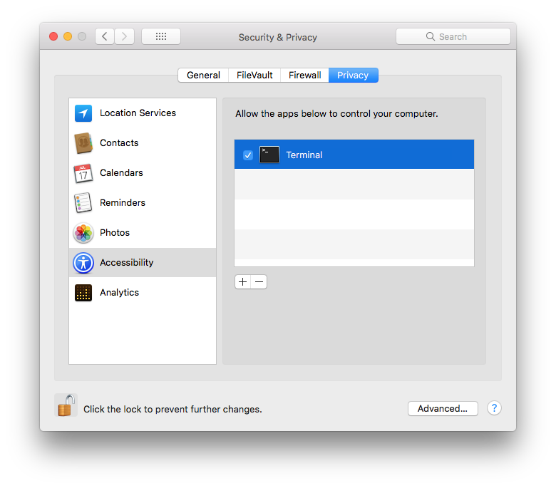
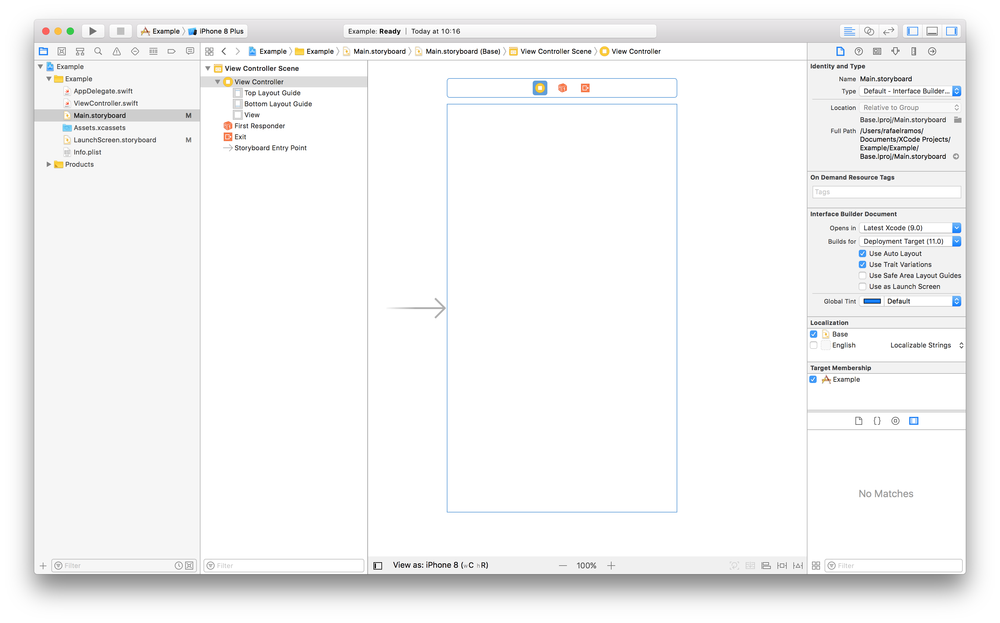

# Safe Area Robot

## Motivation

Working on big probject, with legacy code is hard, and when Apple introduces new technology, sometimes, adopting to it can be painful, if it requires a file-by-file change.
One could argue that we can diff out the files and just "bulk apply" to other. Yes we could, but in this case (Safe Area Guides), it turns out that when you change the toggle, Interface Builder changes some constraints on your behalf, and well... you got the point.

## Usage

With `AppleScript` and `Accessibility` we can automate this boring and repetitive task.
Just keep in mind that these script are not meant to resolve world hunger, so please, bear with me.
Make sure to add `Terminal` app to the `Accessibility` list.



## Xcode UI State

Before you start, make sure that your Xcode looks like the following (`Utilities` pane, on the right, open along with `Indentity and Type` selected).
This step is important because since we use Accessibility, sometimes it can lost track of UI elements and the script will fail to execute.



### Running the script

Make sure to have a book or a cup of coffee, before you start.
Open the `Terminal` on run the script passing the project folder as the argument.

```bash
$ ./safeArea.sh ~/Documents/XCode\ Projects/Example
```

Step away from keyboard and trackpad and let the script run.
Go have fun outside :P

